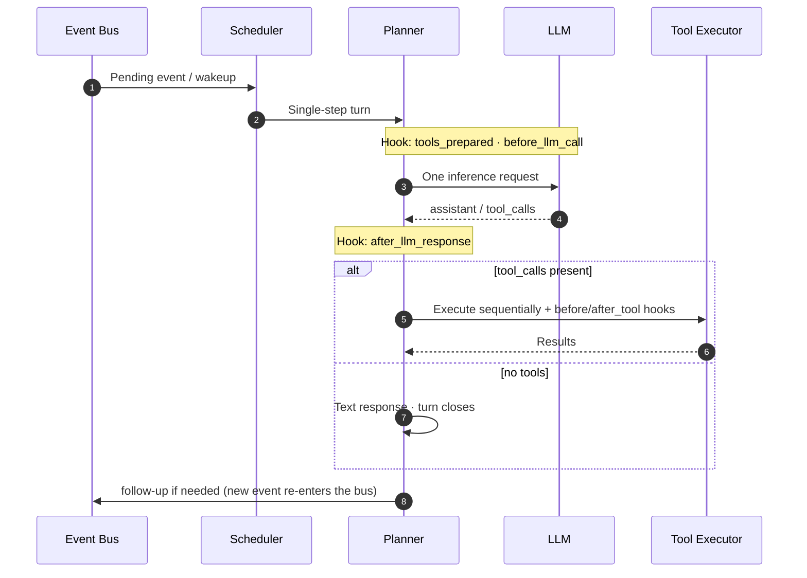

# FairyClaw

FairyClaw is an async agent runtime built for **long-running server-side deployments**. It structures session scheduling, LLM inference, and capability extension into clear layers, so complex tasks can run in parallel and be resumed — while still following a **clean, predictable main execution path**.



---

## Key Features

**Event-driven, single-step advancement**
Sessions are driven by runtime events. The Planner advances via a "one inference step → re-wakeup" loop rather than stuffing an entire task chain into a single request. The main path stays short and observable, making multi-session isolation, compensation, and monitoring straightforward.

**Capability Groups: cluster first, route second**
Capabilities are not a flat list of tool names. Related tools, Hooks, and extensions are declared together as a **Capability Group**. Sub-agents route between groups — first bucketing semantically similar capabilities, then enabling the tool set within the chosen bucket — collapsing "what to pick" from an unbounded tool list into a small set of structured decisions.

**Structured capability groups with built-in workflows —— new Skills defination instead of Skill.md**
Capability groups bundle related tools together with descriptions that guide tool selection order. The `SourcedResearch` group is an example: three tools enforce a search → excerpt → citation-format pipeline so sub-agents produce verifiable, citation-backed answers rather than unsupported claims. This group is not exposed to the main Planner; it is enabled only when the `ToolRouter` selects it for a delegated sub-task.

**Clean execution path + full plugin architecture**
The core orchestration stays lean and well-bounded. Concrete capabilities are delivered via manifest + script: tools, Turn Hooks, runtime event Hooks, and custom `event_types` are all registered declaratively rather than hard-coded in core.

**Dual-process architecture**
The Business process (runtime + Planner) and the Gateway process (user-facing adapters: WebSocket web UI at `/v1/ws`, OneBot, etc.) communicate over an internal WebSocket bridge. Responsibilities are cleanly separated; the Gateway can scale or be replaced independently.

---

## Documentation

Keep **[AI_SYSTEM_GUIDE.md](AI_SYSTEM_GUIDE.md)** and this **README** aligned with the running system when you change gateway surfaces, bridge behavior, or control-plane events (they are the canonical entry points for humans and tooling).

| Document | Contents |
|---|---|
| [AI_SYSTEM_GUIDE.md](AI_SYSTEM_GUIDE.md) | **Canonical system reference**: architecture, event model, Hook protocol, Sub-Agent mechanics, development conventions (useful for both AI assistants and human developers) |
| [README.md](README.md) | **Project overview**, quick start, and documentation index |
| [LAYOUT.md](LAYOUT.md) | Module responsibility map: every directory and key file at a glance |
| [docs/GATEWAY_ENVELOPE.md](docs/GATEWAY_ENVELOPE.md) | Gateway–Business WebSocket bridge protocol: frame structure, lifecycle, file transfer |
| [fairyclaw/core/gateway_protocol/GATEWAY_RUNTIME_PROTOCOL.md](fairyclaw/core/gateway_protocol/GATEWAY_RUNTIME_PROTOCOL.md) | Control envelope types and web `/v1/ws` push shapes (including `kind=event` tool_call / tool_result) |
| [DEPLOY.md](DEPLOY.md) | Deployment guide: Python venv, Docker Compose, systemd, Web UI, OneBot/NapCat setup |
| [CONTRIBUTING.md](CONTRIBUTING.md) | Contribution guide: capability group extension, Hook boundary types, manifest schema |

---

## Quick Start

```bash
# 1. Install
python3 -m venv .venv && source .venv/bin/activate
pip install -e .

# 2. Export your LLM API key (matches config/llm_endpoints.yaml*.api_key_env)
export OPENAI_API_KEY="your_openai_api_key"

# 3. Start all-in-one (build web + start business/gateway)
fairyclaw start
```

`fairyclaw start` defaults:
- business: `0.0.0.0:16000`
- gateway/web: `0.0.0.0:8081` (`/app`)
- config: project `config/` (resolved from the current working directory; created if missing); state under project `data/`
- if those ports are still held by a previous uvicorn, stale listeners are stopped automatically (`lsof`/`fuser`); use `--no-kill-stale` to disable

Cold start: `fairyclaw start` seeds `config/fairyclaw.env` from `config/fairyclaw.env.example` and `config/llm_endpoints.yaml` from `config/llm_endpoints.yaml.example` when a target file is missing or empty/invalid. The running process reads and writes those same paths (including API/UI updates), so changes stay in the repo tree. If `config/` is absent (e.g. wheel-only install), it is created and bundled templates inside the `fairyclaw` package are used when needed.

If needed, also set `FAIRYCLAW_API_TOKEN` before startup to override the default placeholder token used by the web gateway auth.

For detailed steps — Docker, systemd, Web UI, OneBot/NapCat integration — see [DEPLOY.md](DEPLOY.md). For packaging wheels with embedded frontend assets, run `python scripts/prepare_web_dist.py` before `python -m build`.

---

## Extending Capabilities

The fastest way to extend FairyClaw is to add a capability group directory under `fairyclaw/capabilities/`:

```
fairyclaw/capabilities/my_group/
├── manifest.json    ← declare tools, skills, hooks
└── scripts/
    └── my_tool.py   ← tool implementation
```

For Hook boundary types, manifest field conventions, and complete examples, see [CONTRIBUTING.md](CONTRIBUTING.md).

---

## License

[MIT](LICENSE) © 2026 FairyClaw contributors, PKU DS Lab
